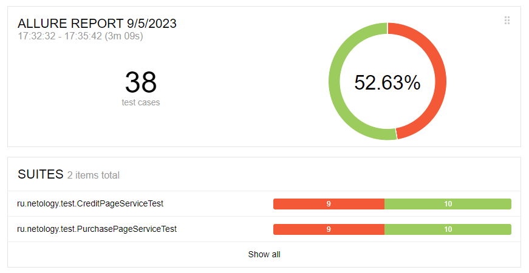
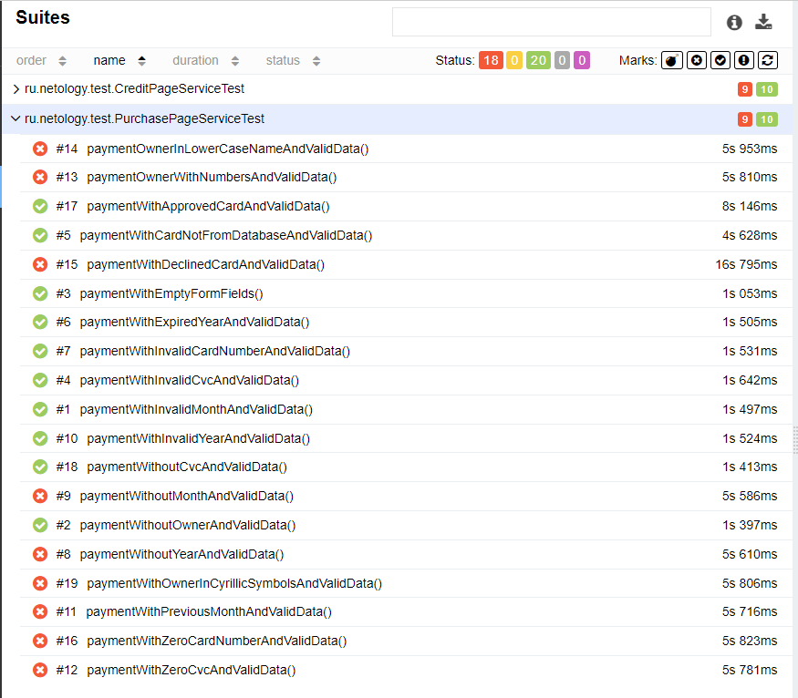
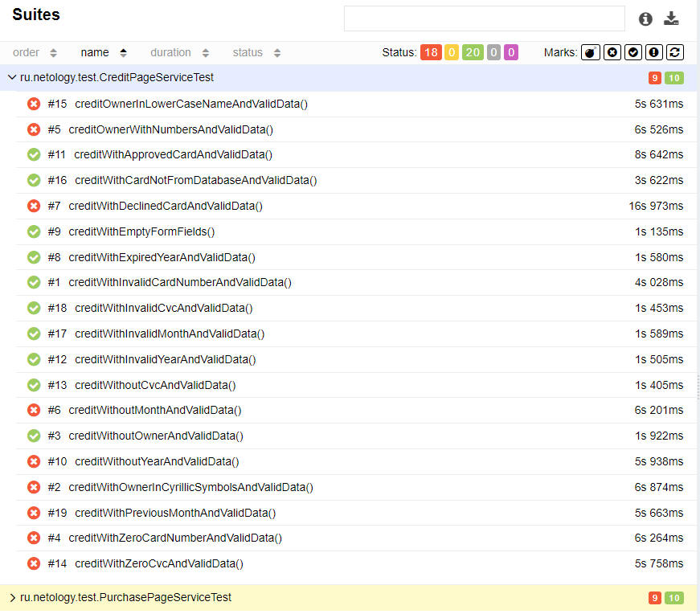

# Отчет по итогам тестирования
## Краткое описание
Было проведено автоматизированное тестирование функционала веб-сервиса "Путешествие дня", взаимодействующего с СУБД и API Банка.
Все тестовые сценарии автоматизированы. Проверены два варианта оплаты:
* Покупка по дебетовой карте (Купить)
* Оформление кредита по данным банковской карты (Купить в кредит)

Тестирование проведено с использованием двух СУБД:
* MySQL
* PostgreSQL
## Количество тест-кейсов
Всего составлено 38 тестов, из них:
* Успешных - 20 (52.63%)
* Неуспешных - 18 (47.36%)
  

Результаты PurchasePageServiceTest:

Результаты CreditPageServiceTest:

В результате тестирования было составлено 7 issues.

## Общие рекомендации
1. Добавить уникальные CSS селекторы для элементов страниц (test-id) для ускорения и упрощения автоматизации тестирования
2. Настроить валидацию поля "Владелец"
2. Исправить текст уведомления при заполнении формы с ошибками. Текст уведомления должен указывать на конкретную ошибку
   